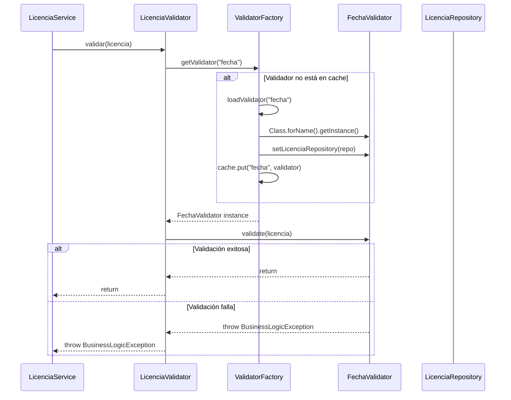

# Sistema de Validaciones con Patrón Factory

Este documento describe el sistema de validaciones basado en el patrón Factory implementado para reemplazar el sistema anterior basado en Spring DI.

## Características Principales

- **Carga lazy (bajo demanda)**: Los validadores se cargan solo cuando se necesitan
- **Cache de instancias**: Una vez cargado, el validador se mantiene en memoria
- **Patrón Singleton**: Cada validador implementa Singleton
- **Manejo de errores robusto**: Captura errores de reflexión y los maneja apropiadamente
- **Sin archivos de configuración**: Utiliza convenciones de nomenclatura

## Arquitectura

### Componentes Principales

1. **Validator<T>**: Interfaz base para todos los validadores
2. **ValidatorFactory**: Factory que gestiona la carga y cache de validadores para licencias
3. **DesignacionValidatorFactory**: Factory específico para validadores de designaciones
4. **CargoValidatorFactory**: Factory específico para validadores de cargos
5. **Validadores principales**: LicenciaValidator, DesignacionValidator, CargoValidator
6. **Validadores específicos**: Implementaciones concretas en los paquetes `validators`

### Convenciones de Nomenclatura

Los factories buscan clases siguiendo estos patrones:

**Para Licencias:**
```
unpsjb.labprog.backend.business.validator.licencia.validators.{CapitalizedName}Validator
```

**Para Designaciones:**
```
unpsjb.labprog.backend.business.validator.designacion.validators.{CapitalizedName}Validator
```

**Para Cargos:**
```
unpsjb.labprog.backend.business.validator.cargo.validators.{CapitalizedName}Validator
```

Ejemplos:
- `"solapamiento"` → `SolapamientoValidator`
- `"designaciones"` → `DesignacionesValidator` 
- `"articulo5a"` → `Articulo5aValidator`
- `"fecha"` → `FechaValidator`
- `"tipodesignaciondivision"` → `TipodesignaciondivisionValidator`

## Validadores Implementados

### Validadores de Licencias
- **FechaValidator**: Valida rangos de fechas
- **SolapamientoValidator**: Verifica solapamiento entre licencias
- **DesignacionesValidator**: Verifica designaciones activas
- **Articulo5aValidator**: Artículo 5A - Enfermedad (máx 30 días/año, certificado médico)
- **Articulo23aValidator**: Artículo 23A - Atención familiar (máx 30 días/año)
- **Articulo36aValidator**: Artículo 36A - Asuntos particulares (máx 2 días/mes, 6 días/año)

### Validadores de Designaciones
- **FechaValidator**: Valida rangos de fechas
- **SolapamientoValidator**: Verifica solapamiento entre designaciones

### Validadores de Cargos
- **FechaValidator**: Valida rangos de fechas
- **TipodesignaciondivisionValidator**: Valida relación entre tipo de designación y división

## Funcionamiento del Sistema por Dominio

### Sistema de Validaciones de Licencias

El `LicenciaValidator` utiliza el `ValidatorFactory` para cargar y aplicar múltiples validadores específicos:

```java
@Component
public class LicenciaValidator {
    @Autowired
    private ValidatorFactory validatorFactory;
    
    public void validar(Licencia licencia) throws BusinessLogicException {
        // Validaciones básicas
        Validator<Licencia> fechaValidator = validatorFactory.getValidator("fecha");
        if (fechaValidator != null) {
            fechaValidator.validate(licencia);
        }
        
        // Validación de solapamiento
        Validator<Licencia> solapamientoValidator = validatorFactory.getValidator("solapamiento");
        if (solapamientoValidator != null) {
            solapamientoValidator.validate(licencia);
        }
        
        // Validaciones específicas por artículo
        if (licencia.getArticulo() != null) {
            String validatorName = licencia.getArticulo().getDescripcion().toLowerCase().replace(" ", "");
            Validator<Licencia> articuloValidator = validatorFactory.getValidator(validatorName);
            if (articuloValidator != null) {
                articuloValidator.validate(licencia);
            }
        }
    }
}
```

### Sistema de Validaciones de Designaciones

El `DesignacionValidator` funciona de manera similar pero con su propio factory:

```java
@Component
public class DesignacionValidator {
    @Autowired
    private DesignacionValidatorFactory validatorFactory;
    
    public void validar(Designacion designacion) throws BusinessLogicException {
        // Validación de fechas
        Validator<Designacion> fechaValidator = validatorFactory.getValidator("fecha");
        if (fechaValidator != null) {
            fechaValidator.validate(designacion);
        }
        
        // Validación de solapamiento
        Validator<Designacion> solapamientoValidator = validatorFactory.getValidator("solapamiento");
        if (solapamientoValidator != null) {
            solapamientoValidator.validate(designacion);
        }
    }
}
```

### Sistema de Validaciones de Cargos

El `CargoValidator` aplica validaciones específicas para cargos:

```java
@Component
public class CargoValidator {
    @Autowired
    private CargoValidatorFactory validatorFactory;
    
    public void validar(Cargo cargo) throws BusinessLogicException {
        // Validación de fechas
        Validator<Cargo> fechaValidator = validatorFactory.getValidator("fecha");
        if (fechaValidator != null) {
            fechaValidator.validate(cargo);
        }
        
        // Validación de tipo designación y división
        Validator<Cargo> tipoValidator = validatorFactory.getValidator("tipodesignaciondivision");
        if (tipoValidator != null) {
            tipoValidator.validate(cargo);
        }
    }
}
```

## Uso del Sistema

Los servicios utilizan los validadores principales:

```java
@Service
public class LicenciaService {
    @Autowired
    private LicenciaValidator validator;
    
    public Licencia save(Licencia licencia) {
        try {
            validator.validar(licencia); // Aplica todas las reglas
            licencia.setEstado(Estado.VALIDO);
        } catch (BusinessLogicException e) {
            licencia.setEstado(Estado.INVALIDO);
            // Manejar error...
        }
        return repository.save(licencia);
    }
}
```

## Agregar Nuevos Validadores

Para agregar un nuevo validador:

1. Crear la clase en `validators/` siguiendo las convenciones:
```java
public class MiNuevoValidator implements Validator<Licencia> {
    private static MiNuevoValidator instance = null;
    
    private MiNuevoValidator() {}
    
    public static MiNuevoValidator getInstance() {
        if (instance == null)
            instance = new MiNuevoValidator();
        return instance;
    }
    
    @Override
    public void validate(Licencia licencia) throws BusinessLogicException {
        // Lógica de validación
    }
}
```

2. Usar en LicenciaValidator:
```java
Validator<Licencia> miValidador = validatorFactory.getValidator("minuevo");
if (miValidador != null) {
    miValidador.validate(licencia);
}
```

## Ventajas del Sistema

1. **Extensibilidad**: Fácil agregar nuevos validadores sin modificar código existente
2. **Mantenibilidad**: Cada validador es independiente y reutilizable
3. **Performance**: Cache evita recrear instancias
4. **Flexibilidad**: Validadores se cargan dinámicamente según necesidad
5. **Testabilidad**: Cada validador puede probarse independientemente

## Migración desde Sistema Anterior

El sistema anterior basado en `LicenciaValidationRule` y Spring DI ha sido completamente reemplazado. Los tests existentes deberían seguir funcionando sin cambios ya que la interfaz pública del `LicenciaValidator.validar()` se mantiene igual.

## Diagrama de Clases

```mermaid
classDiagram
    class Validator~T~ {
        <<interface>>
        +validate(T entity)
    }
    
    %% Factories
    class ValidatorFactory {
        -Map~String, Validator~ validatorCache
        -LicenciaRepository licenciaRepository
        +getValidator(String name) Validator~Licencia~
        -loadValidator(String name) Validator~Licencia~
    }
    
    class DesignacionValidatorFactory {
        -Map~String, Validator~ validatorCache
        -DesignacionRepository designacionRepository
        +getValidator(String name) Validator~Designacion~
        -loadValidator(String name) Validator~Designacion~
    }
    
    class CargoValidatorFactory {
        -Map~String, Validator~ validatorCache
        -CargoRepository cargoRepository
        +getValidator(String name) Validator~Cargo~
        -loadValidator(String name) Validator~Cargo~
    }
    
    %% Main Validators
    class LicenciaValidator {
        -ValidatorFactory validatorFactory
        +validar(Licencia licencia)
    }
    
    class DesignacionValidator {
        -DesignacionValidatorFactory validatorFactory
        +validar(Designacion designacion)
    }
    
    class CargoValidator {
        -CargoValidatorFactory validatorFactory
        +validar(Cargo cargo)
    }
    
    %% Licencia Validators
    class LicenciaFechaValidator {
        -LicenciaFechaValidator instance
        +getInstance() LicenciaFechaValidator
        +validate(Licencia licencia)
    }
    
    class LicenciaSolapamientoValidator {
        -LicenciaSolapamientoValidator instance
        -LicenciaRepository licenciaRepository
        +getInstance() LicenciaSolapamientoValidator
        +setLicenciaRepository(LicenciaRepository repo)
        +validate(Licencia licencia)
    }
    
    class DesignacionesValidator {
        -DesignacionesValidator instance
        -DesignacionRepository designacionRepository
        +getInstance() DesignacionesValidator
        +setDesignacionRepository(DesignacionRepository repo)
        +validate(Licencia licencia)
    }
    
    class Articulo5aValidator {
        -Articulo5aValidator instance
        -LicenciaRepository licenciaRepository
        +getInstance() Articulo5aValidator
        +setLicenciaRepository(LicenciaRepository repo)
        +validate(Licencia licencia)
    }
    
    class Articulo23aValidator {
        -Articulo23aValidator instance
        -LicenciaRepository licenciaRepository
        +getInstance() Articulo23aValidator
        +setLicenciaRepository(LicenciaRepository repo)
        +validate(Licencia licencia)
    }
    
    class Articulo36aValidator {
        -Articulo36aValidator instance
        -LicenciaRepository licenciaRepository
        +getInstance() Articulo36aValidator
        +setLicenciaRepository(LicenciaRepository repo)
        +validate(Licencia licencia)
    }
    
    %% Designacion Validators
    class DesignacionFechaValidator {
        -DesignacionFechaValidator instance
        +getInstance() DesignacionFechaValidator
        +validate(Designacion designacion)
    }
    
    class DesignacionSolapamientoValidator {
        -DesignacionSolapamientoValidator instance
        -DesignacionRepository designacionRepository
        +getInstance() DesignacionSolapamientoValidator
        +setDesignacionRepository(DesignacionRepository repo)
        +validate(Designacion designacion)
    }
    
    %% Cargo Validators
    class CargoFechaValidator {
        -CargoFechaValidator instance
        +getInstance() CargoFechaValidator
        +validate(Cargo cargo)
    }
    
    class TipodesignaciondivisionValidator {
        -TipodesignaciondivisionValidator instance
        -CargoRepository cargoRepository
        +getInstance() TipodesignaciondivisionValidator
        +setCargoRepository(CargoRepository repo)
        +validate(Cargo cargo)
    }
    
    %% Relationships
    Validator~T~ <|.. LicenciaFechaValidator
    Validator~T~ <|.. LicenciaSolapamientoValidator
    Validator~T~ <|.. DesignacionesValidator
    Validator~T~ <|.. Articulo5aValidator
    Validator~T~ <|.. Articulo23aValidator
    Validator~T~ <|.. Articulo36aValidator
    Validator~T~ <|.. DesignacionFechaValidator
    Validator~T~ <|.. DesignacionSolapamientoValidator
    Validator~T~ <|.. CargoFechaValidator
    Validator~T~ <|.. TipodesignaciondivisionValidator
    
    LicenciaValidator --> ValidatorFactory : uses
    DesignacionValidator --> DesignacionValidatorFactory : uses
    CargoValidator --> CargoValidatorFactory : uses
    
    ValidatorFactory --> LicenciaFechaValidator : creates
    ValidatorFactory --> LicenciaSolapamientoValidator : creates
    ValidatorFactory --> DesignacionesValidator : creates
    ValidatorFactory --> Articulo5aValidator : creates
    ValidatorFactory --> Articulo23aValidator : creates
    ValidatorFactory --> Articulo36aValidator : creates
    
    DesignacionValidatorFactory --> DesignacionFechaValidator : creates
    DesignacionValidatorFactory --> DesignacionSolapamientoValidator : creates
    
    CargoValidatorFactory --> CargoFechaValidator : creates
    CargoValidatorFactory --> TipodesignaciondivisionValidator : creates
    
    note for ValidatorFactory "Utiliza reflexión para cargar\nvalidadores dinámicamente\nsegún convención de nombres"
    note for DesignacionValidatorFactory "Factory específico para\nvalidadores de designaciones"
    note for CargoValidatorFactory "Factory específico para\nvalidadores de cargos"
```



## Flujo de Ejecución



## Notas de Implementación

- **Inyección de Dependencias**: Los validadores Singleton reciben dependencias vía setters después de la creación
- **Manejo de Errores**: El factory captura errores de reflexión y retorna null, permitiendo que el flujo continúe
- **Thread Safety**: Los validadores Singleton deben ser thread-safe
- **Convenciones**: Es importante seguir las convenciones de nomenclatura para que la reflexión funcione correctamente
