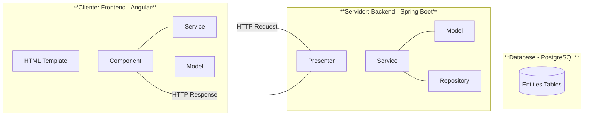

<!-- omit in toc -->
# Sistema de Gestión de Novedades Docentes - Escuela 775

<!-- omit in toc -->
## Información del Trabajo
- **Nombre del Trabajo:** Partes Docente
- **Estudiante:** Mariano Bonansea
- **Asignatura:** Laboratorio de Programación y Lenguajes
- **Fecha de inicio:** 21/04/2025
- **Fecha de finalización:** 

<!-- omit in toc -->
## Índice
- [Introducción](#introducción)
- [Problema](#problema)
- [Objetivos](#objetivos)
- [Características Principales](#características-principales)
- [Arquitectura de la Solución](#arquitectura-de-la-solución)
  - [Stack Tecnológico](#stack-tecnológico)
  - [Diagrama de Arquitectura](#diagrama-de-arquitectura)
- [Modelo de Dominio](#modelo-de-dominio)
- [Consideraciones de Diseño](#consideraciones-de-diseño)
  - [Atributos y Relaciones](#atributos-y-relaciones)
    - [Licencia](#licencia)
    - [Designación](#designación)
    - [ArtículoLicencia](#artículolicencia)
    - [Persona](#persona)
    - [Cargo](#cargo)
    - [División](#división)
    - [Horario](#horario)
  - [Validaciones y Restricciones](#validaciones-y-restricciones)
- [Bitácora de Desarrollo](#bitácora-de-desarrollo)
  - [Sprint 1: Configuración del Entorno (19/04/2025 - 25/04/2025)](#sprint-1-configuración-del-entorno-19042025---25042025)
  - [Sprint 2: Nueva Persona y Nueva División (26/04/2025 - 30/05/2025)](#sprint-2-nueva-persona-y-nueva-división-26042025---30052025)
- [Referencias](#referencias)

## Introducción

Este proyecto implementa un sistema de gestión de novedades docentes para la Escuela 775 de Puerto Madryn. La aplicación permite administrar designaciones docentes, licencias, suplencias y generación de reportes para el seguimiento del personal.

## Problema

La Escuela 775 necesita gestionar el registro de licencias solicitadas por los docentes, validar su cumplimiento según la normativa del Ministerio de Educación de Chubut, y generar reportes como el "parte diario de novedades del personal". Actualmente este proceso se realiza manualmente, lo que genera inconsistencias y dificulta el seguimiento.

## Objetivos

- Administrar tipos de designación, divisiones y cargos docentes
- Gestionar personal y sus designaciones a cargos o espacios curriculares
- Procesar solicitudes de licencia con validaciones automáticas
- Generar informes de licencias y novedades del personal
- Visualizar la distribución de espacios curriculares y docentes en formato calendario

## Características Principales

- Gestión completa de cargos, divisiones y tipos de designación
- Administración de personal y designaciones
- Sistema de licencias con validaciones automáticas según normativa vigente
- Reportes: parte diario, informe anual de concepto, mapa de horarios
- Detección de espacios curriculares sin cubrir

## Arquitectura de la Solución

### Stack Tecnológico
- **Frontend:** Angular
- **Backend:** Spring Boot
- **Base de Datos:** PostgreSQL
- **ORM:** JPA
- **Contenedorización:** Docker y Docker Compose
- **Control de Versiones:** Git
- **Gestión de Proyectos:** GitLab 

### Diagrama de Arquitectura

El sistema emplea una arquitectura en capas con separación clara entre frontend y backend:

## Modelo de Dominio

## Consideraciones de Diseño
Se han tomado en cuenta las siguientes consideraciones para el diseño del sistema con respecto al modelo de dominio:

### Atributos y Relaciones

#### Licencia
- **pedidoDesde/pedidoHasta**: Fechas obligatorias que delimitan el período de licencia solicitado.
- **domicilio**: Campo opcional que indica dónde se encuentra la persona durante su licencia.
- **certificadoMedico**: Indicador booleano que señala si la licencia tiene respaldo médico.
- **Relaciones**: Una licencia siempre está asociada a una Persona y a un ArtículoLicencia específico, y puede afectar a múltiples Designaciones.

#### Designación
- **situacionRevista**: Campo obligatorio que describe la situación laboral del docente (ej. titular, suplente).
- **fechaInicio/fechaFin**: Fechas obligatorias que delimitan la vigencia de la designación.
- **Relaciones**: Vincula a una Persona con un Cargo específico. Una persona puede tener múltiples designaciones, pero cada designación corresponde a una única persona y cargo.

#### ArtículoLicencia
- **articulo**: Código único y obligatorio que identifica el artículo reglamentario.
- **descripcion**: Detalle textual del artículo de licencia, puede ser de longitud extensa.
- **Relaciones**: Un artículo puede ser utilizado en múltiples licencias.

#### Persona
- **dni**: Identificador único obligatorio (clave primaria) de la persona.
- **cuil**: Campo único y obligatorio, con formato específico para CUIL argentino.
- **nombre/apellido**: Campos obligatorios que identifican a la persona.
- **titulo/sexo/domicilio/telefono**: Campos opcionales para información complementaria.
- **Relaciones**: Una persona puede tener múltiples designaciones y solicitar múltiples licencias.

#### Cargo
- **nombre**: Campo obligatorio que identifica el cargo o espacio curricular.
- **cargaHoraria**: Valor numérico no negativo que se inicializa en 0 si no se especifica.
- **fechaInicio/fechaFin**: Fechas obligatorias que delimitan la vigencia del cargo.
- **tipoDesignacion**: Valor obligatorio que especifica si es un cargo administrativo o un espacio curricular.
- **Relaciones**: Un cargo puede estar asociado opcionalmente a una División (solo si es un espacio curricular) y debe tener al menos un Horario asignado.

#### División
- **anio**: Campo numérico obligatorio que indica el año escolar (1º a 6º).
- **numDivision**: Campo numérico obligatorio que identifica la división dentro del año.
- **orientacion**: Campo opcional que especifica la orientación curricular.
- **turno**: Valor enumerado obligatorio (Mañana, Tarde, Vespertino, Noche).
- **Relaciones**: Una división puede tener múltiples cargos (espacios curriculares) asociados.

#### Horario
- **dia**: Campo obligatorio que especifica el día de la semana.
- **hora**: Valor numérico obligatorio que indica la hora asignada (1ª a 8ª).
- **Relaciones**: Cada horario está asociado a un único Cargo.

### Validaciones y Restricciones

Se implementan múltiples niveles de validación:

1. **Validación a nivel de modelo**: Uso de `@NotNull` (Jakarta Bean Validation) para validación en tiempo de ejecución
2. **Validación a nivel de base de datos**: Restricciones `nullable = false` para garantizar integridad en la DB
3. **Validación a nivel de código**: Anotaciones `@NonNull` (Lombok) para generar validaciones en constructores y setters

## Bitácora de Desarrollo

El desarrollo del proyecto se organizó en sprints semanales:

### Sprint 1: Configuración del Entorno (19/04/2025 - 25/04/2025)
- **⏳ Planificación:**
  - ⏳ Configuración de Docker y Docker Compose. 
  - ⏳ Creación del proyecto Angular para el frontend.
  - ⏳ Creación del proyecto Spring Boot para el backend.

- **✅ Avance:**
  - ✅ Configuración completa del entorno Docker con PostgreSQL.
  - ✅ Creación exitosa de la estructura básica del proyecto Angular.
  - ✅ Implementación del proyecto Spring Boot.
  - ➕ Creacion de los modelos en el frontend y backend.
  - ➕ Frontend: HomePage, lista de personas y persona-detail.
  - ➕ Primera tarjeta "Nueva persona" completada (solo CR).

- **🛑 Desafíos encontrados:**
  - 🛑 Problemas al configurar el contenedor de testing - *🔧 Solución: Actualizar la version de cucumber a @Cucumber/cucumber (la ultima version con soporte)*.  

### Sprint 2: Nueva Persona y Nueva División (26/04/2025 - 30/05/2025)
- **⏳ Planificación:**
  - ⏳ Ampliar test de persona para incluir las operaciones de CRUD restantes.
  - ⏳ Mejorar la interfaz grafica de la lista de personas.
  - ⏳ Implementar la funcionalidad de editar y eliminar personas (frontend).
  - ⏳ Desarrollar la segunda tarjeta "Nueva División" completa.

- **✅ Avance:**
  
  
- **❌ No cumplido:**

- **🛑 Desafíos encontrados:**

## Referencias

- [Consignas del Proyecto](https://git.fi.mdn.unp.edu.ar/marianobonansea/partes-doscente/-/blob/main/Consignas.md)